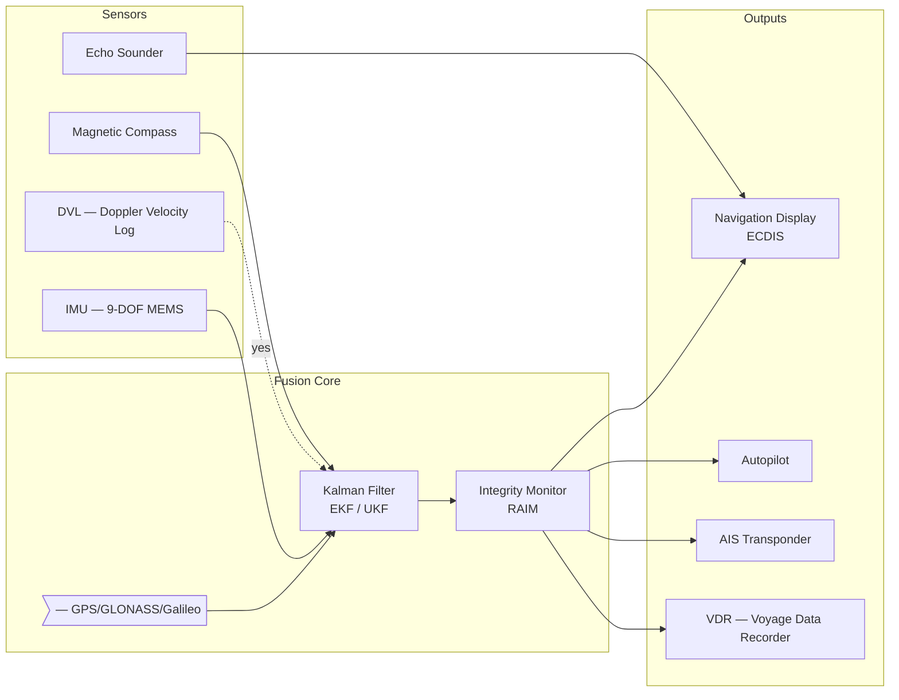
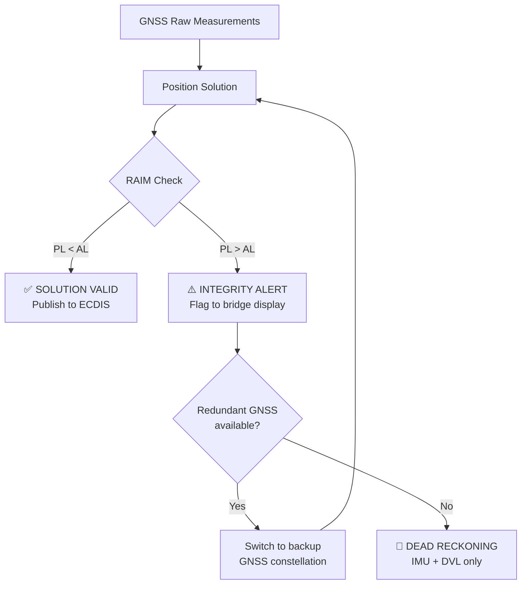

# Integrated Navigation & Positioning System — Naval Platform

> **Document type:** System Design Specification **Classification:** UNCLASSIFIED / COMMERCIAL **Platform:** OPV-500 Offshore Patrol Vessel **Version:** 2.1.0 | **Status:** `APPROVED`

---

## 1. Purpose & Scope

This document defines the architecture, algorithms, and interface specifications of the **INPS-2** (Integrated Navigation and Positioning System) installed aboard the OPV-500 class. INPS-2 fuses data from multiple sensors to provide continuous, high-integrity positioning for both open-ocean and coastal navigation.

> **TIP** All Mermaid diagrams render in real time inside Notipad. Switch to plain text mode to inspect raw source.

---

##

## 2. System Architecture



---

##

## 3. Navigation State Vector

The navigation state is estimated by an Extended Kalman Filter (EKF). The state vector $\mathbf{x}$ is defined as:

$$\mathbf{x} = \begin{bmatrix} \phi & \lambda & h & v_N & v_E & v_D & \psi & \theta & \phi_r & b_{gx} & b_{gy} & b_{gz} \end{bmatrix}^T$$

where $(\phi, \lambda, h)$ are latitude, longitude, and altitude; $(v_N, v_E, v_D)$ are NED velocities; $(\psi, \theta, \phi_r)$ are yaw, pitch and roll; and $\mathbf{b}_g$ is the gyroscope bias vector.

### 3.1 Process Model

The discrete-time state transition:

$$\mathbf{x}_{k+1} = \mathbf{F}_k \mathbf{x}_k + \mathbf{G}_k \mathbf{u}_k + \mathbf{w}_k, \quad \mathbf{w}_k \sim \mathcal{N}(0, \mathbf{Q}_k)$$

The Earth-Relative Navigation equations (mechanization):

$$\dot{\phi} = \frac{v_N}{R_M + h}, \qquad \dot{\lambda} = \frac{v_E}{(R_N + h)\cos\phi}$$

$$\dot{v}*N = f_N - (2\omega*{ie}\sin\phi + \frac{v_E \tan\phi}{R_N + h})v_E + \frac{v_N v_D}{R_M + h}$$

where $R_M$ and $R_N$ are the meridian and normal radii of curvature of the WGS-84 ellipsoid.

### 3.2 Measurement Update

GNSS position fix:

$$\mathbf{z}_k = \mathbf{H}_k \mathbf{x}_k + \mathbf{v}_k, \quad \mathbf{v}_k \sim \mathcal{N}(0, \mathbf{R}_k)$$

Kalman gain:

$$\mathbf{K}_k = \mathbf{P}_k^- \mathbf{H}_k^T \left(\mathbf{H}_k \mathbf{P}_k^- \mathbf{H}_k^T + \mathbf{R}_k\right)^{-1}$$

---

## 4. Sensor Specifications

### 4.1 GNSS Receiver

| Parameter | Value | Notes |
| --- | --- | --- |
| Constellations | GPS L1/L2, GLONASS, Galileo | Dual frequency |
| Horizontal accuracy | 0.6 m CEP | With DGNSS correction |
| Velocity accuracy | 0.03 m/s RMS |  |
| Update rate | 10 Hz |  |
| TTFF (cold start) | < 45 s |  |
| Anti-jamming | Adaptive null-steering | 7-element antenna array |
| Anti-spoofing | Signal authentication | OSNMA (Galileo) |

### 4.2 IMU

| Parameter | Value | Unit |
| --- | --- | --- |
| Gyroscope ARW | 0.1 | °/√h |
| Gyroscope bias instab. | 1.0 | °/h |
| Accelerometer noise | 50 | μg/√Hz |
| Accelerometer bias | 0.3 | mg |
| Sample rate | 400 | Hz |
| Axes | 3 gyro + 3 accel + 3 mag | — |

### 4.3 DVL

| Parameter | Value | Notes |
| --- | --- | --- |
| Velocity accuracy | ± 0.2% ± 2 mm/s | Bottom-track mode |
| Frequency | 600 kHz | Shallow water |
| Max depth (bottom) | 300 m |  |
| Beam configuration | 4-beam Janus | 30° beam angle |
| Update rate | 5 Hz |  |

---

## 5. NMEA 2000 Message Interface

The INPS-2 publishes all navigation data over the ship's NMEA 2000 backbone. Key PGNs:

| PGN | Name | Rate | Fields |
| --- | --- | --- | --- |
| 129025 | Position, Rapid Update | 10 Hz | Latitude, Longitude |
| 129026 | COG & SOG, Rapid Update | 10 Hz | COG (True/Magnetic), SOG |
| 129029 | GNSS Position Data | 1 Hz | Full position, DOP, fix quality |
| 127257 | Attitude | 10 Hz | Yaw, Pitch, Roll |
| 127250 | Vessel Heading | 10 Hz | Magnetic/True heading, deviation |
| 128267 | Water Depth | 1 Hz | Depth, offset, range |

---

## 6. Integrity Monitoring (RAIM)

Receiver Autonomous Integrity Monitoring computes a Protection Level (PL) that must satisfy:

$$PL_{H} < AL_{H} = 185 \text{ m}$$

for harbor approach (ECDIS Alert Limit, IEC 61162-1). The Horizontal Protection Level is computed as:

$$PL_H = K_{ffmd} \cdot \sigma_{HPL}$$

where $K_{ffmd} = 5.33$ for $P_{HMI} = 10^{-5}$ per hour (IMO Performance Standards).



---

## 7. Software Interface

Bridge systems subscribe to position data via a multicast UDP stream:

```python
import socket
import struct
import json

MCAST_GRP  = "239.255.0.1"
MCAST_PORT = 5000

def subscribe_navigation_stream():
    """Subscribe to INPS-2 multicast navigation stream."""
    sock = socket.socket(socket.AF_INET, socket.SOCK_DGRAM, socket.IPPROTO_UDP)
    sock.setsockopt(socket.SOL_SOCKET, socket.SO_REUSEADDR, 1)
    sock.bind(("", MCAST_PORT))

    mreq = struct.pack("4sL", socket.inet_aton(MCAST_GRP), socket.INADDR_ANY)
    sock.setsockopt(socket.IPPROTO_IP, socket.IP_ADD_MEMBERSHIP, mreq)

    while True:
        data, _ = sock.recvfrom(1024)
        nav = json.loads(data.decode("utf-8"))
        print(f"Lat: {nav['lat']:.6f}  Lon: {nav['lon']:.6f}  "
              f"SOG: {nav['sog_kts']:.1f} kts  COG: {nav['cog_deg']:.1f}°  "
              f"Integrity: {nav['raim_status']}")
```

Example message payload:

```json
{
  "timestamp_utc": "2026-03-22T14:32:00.120Z",
  "lat":           43.362400,
  "lon":           -8.411500,
  "alt_m":         12.3,
  "sog_kts":       14.2,
  "cog_deg":       187.4,
  "heading_true":  188.1,
  "pitch_deg":     0.8,
  "roll_deg":      2.1,
  "hdop":          0.9,
  "fix_quality":   "DGNSS",
  "raim_status":   "OK",
  "pl_horizontal_m": 1.8
}
```

---

## 8. Alarms & Fault Management

| Alarm ID | Description | Priority | Action |
| --- | --- | --- | --- |
| NAV-001 | GNSS signal lost > 5 s | A | Activate dead reckoning, alert bridge |
| NAV-002 | RAIM integrity failure | A | Switch constellation, alert bridge |
| NAV-003 | IMU bias divergence | B | Recalibrate, log event |
| NAV-004 | DVL bottom-lock lost | B | Use water-track fallback |
| NAV-005 | Position jump > 50 m in 1 s | A | Reject fix, hold last valid |
| NAV-006 | Navigation processor CPU > 90% | C | Log warning, notify engineer |

Priority scale: **A** = immediate, **B** = caution, **C** = advisory (IEC 60945)

---

## 9. Compliance & Standards

- **IEC 61162-1:2016** — NMEA 0183 / NMEA 2000 interface
- **IEC 60945:2002** — Maritime navigation equipment (EMC, environmental)
- **IMO MSC.252(83)** — Adoption of the revised Performance Standards for ECDIS
- **SOLAS Ch. V Reg. 19** — Carriage requirements for shipborne navigational systems
- **ISO 16315:2016** — Small craft — Engine-driven boats — Stability

---

## References

1. Groves, P.D. (2013). *Principles of GNSS, Inertial, and Multisensor Integrated Navigation Systems*, 2nd ed. Artech House.
2. Farrell, J.A. (2008). *Aided Navigation: GPS with High Rate Sensors*. McGraw-Hill.
3. IMO (2004). *Performance Standards for Integrated Navigation Systems (INS)*, Resolution MSC.86(70).