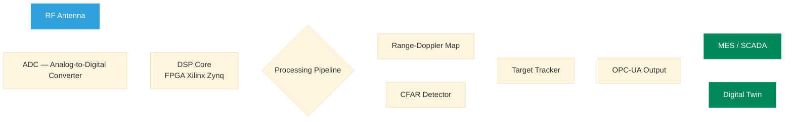
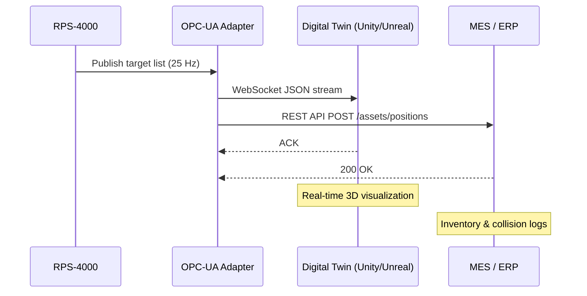

# Radar Signal Processing System — Industry 4.0

> **Document type:** Technical Specification **Version:** 1.4.0 **Status:** `DRAFT` **Last updated:** 2026-03-22

---

## Overview

This document describes the signal processing pipeline for the **RPS-4000** industrial radar sensor deployed in smart manufacturing environments. The system is designed for real-time object detection, collision avoidance, and inventory tracking on automated production floors.

> **TIP** Open this document in rich mode first to preview all rendered blocks, then switch to plain text to verify Markdown portability.

---

## System Architecture



---

## Signal Model

The transmitted FMCW signal is modeled as:

$$s_T(t) = A \cos\left(2\pi f_0 t + \pi \frac{B}{T_c} t^2\right), \quad 0 \leq t \leq T_c$$

where $f_0$ is the carrier frequency, $B$ is the sweep bandwidth, and $T_c$ is the chirp duration.

The received beat signal after mixing:

$$s_b(t) = A_r \cos\left(2\pi \frac{2R}{c} \cdot \frac{B}{T_c} \cdot t + \phi_0\right)$$

Range resolution is given by:

$$\Delta R = \frac{c}{2B}$$

Velocity resolution from Doppler processing:

$$\Delta v = \frac{\lambda}{2 N T_c}$$

where $N$ is the number of chirps per frame and $\lambda = c/f_0$.

---

## Hardware Specifications

| Parameter | Value | Unit | Notes |
| --- | --- | --- | --- |
| Carrier frequency | 77 | GHz | mmWave band |
| Bandwidth | 4 | GHz | Configurable 1–4 GHz |
| Chirp duration | 40 | μs | Per FMCW chirp |
| Range resolution | 3.75 | cm | At max bandwidth |
| Max range | 50 | m | Industrial floor coverage |
| Velocity resolution | 0.12 | m/s | 128 chirps per frame |
| Frame rate | 25 | Hz | Real-time tracking |
| ADC sampling rate | 10 | MSPS | 12-bit resolution |
| Angular resolution | 1.4 | ° | 4-RX virtual aperture |
| Operating temp. | −20 to +70 | °C | IP67 enclosure |

---

## Processing Pipeline

### 1. Range FFT

After sampling the beat signal over each chirp, a Fast Fourier Transform is applied along the fast-time axis:

$$X_r[k] = \sum_{n=0}^{N_s - 1} x[n] \cdot w[n] \cdot e^{-j2\pi kn/N_s}$$

A Hann window $w[n]$ is applied to reduce sidelobe leakage.

### 2. Doppler FFT

A second FFT is applied along the slow-time axis (across chirps) to resolve velocity:

$$X_{rd}[k, l] = \sum_{m=0}^{N_c - 1} X_r^{(m)}[k] \cdot e^{-j2\pi lm/N_c}$$

### 3. CFAR Detection

Constant False Alarm Rate detection using the Cell-Averaging variant (CA-CFAR):

$$\alpha = N_g \left( P_{fa}^{-1/N_g} - 1 \right)$$

```python
def ca_cfar(rd_map, num_guard=2, num_train=8, pfa=1e-4):
    """
    Cell-Averaging CFAR detector.

    Parameters
    ----------
    rd_map    : 2D numpy array — Range-Doppler map (power)
    num_guard : Guard cells on each side
    num_train : Training cells on each side
    pfa       : Desired probability of false alarm

    Returns
    -------
    detections : boolean mask, True at detected targets
    """
    import numpy as np
    nr, nd = rd_map.shape
    alpha   = num_train * (pfa ** (-1.0 / num_train) - 1)
    det     = np.zeros_like(rd_map, dtype=bool)

    for r in range(num_guard + num_train, nr - num_guard - num_train):
        for d in range(num_guard + num_train, nd - num_guard - num_train):
            guard = rd_map[r - num_guard:r + num_guard + 1,
                           d - num_guard:d + num_guard + 1]
            region = rd_map[r - num_guard - num_train:r + num_guard + num_train + 1,
                            d - num_guard - num_train:d + num_guard + num_train + 1]
            noise = (region.sum() - guard.sum()) / (4 * num_train * (num_train + 2 * num_guard))
            det[r, d] = rd_map[r, d] > alpha * noise

    return det
```

---

## OPC-UA Data Model

The radar publishes target data to the factory MES via OPC-UA at 25 Hz. Each detected object exposes the following node structure:

```
Objects/
└── RPS4000/
    ├── Status
    │   ├── IsRunning        (Boolean)
    │   ├── TemperatureC     (Float)
    │   └── FirmwareVersion  (String)
    └── Targets[]
        ├── TargetID         (UInt32)
        ├── Range_m          (Float)
        ├── Velocity_ms      (Float)
        ├── Azimuth_deg      (Float)
        ├── SNR_dB           (Float)
        └── Timestamp        (DateTime)
```

---

## Integration with Digital Twin

The radar feeds live positional data into the factory digital twin via a dedicated adapter:



---

## Failure Modes & Diagnostics

| Code | Description | Severity | Auto-recovery |
| --- | --- | --- | --- |
| E001 | ADC overflow | Warning | Yes |
| E002 | DSP core timeout | Critical | No |
| E003 | Temperature out of range | Warning | Yes |
| E004 | OPC-UA connection lost | Warning | Yes (retry) |
| E005 | Antenna self-test failed | Critical | No |

---

## References

- IEEE Std 521-2019 — Standard Letter Designations for Radar-Frequency Bands
- IEC 61508 — Functional Safety of E/E/PE Safety-related Systems
- OPC Foundation — OPC UA Specification Part 4 (Services), v1.05