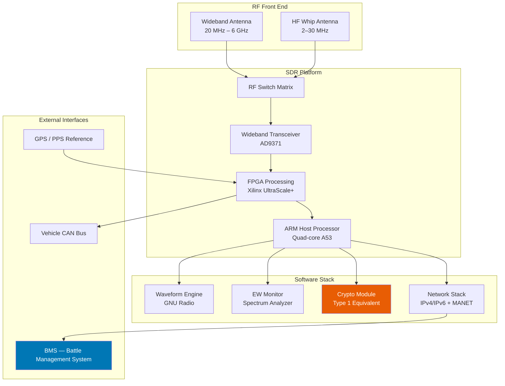
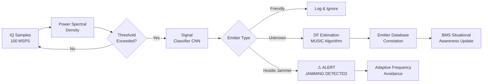
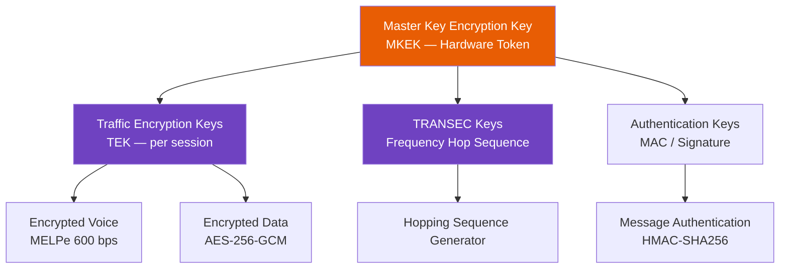

# Tactical Communications & Electronic Warfare System

> **Document type:** Technical Design Document **Classification:** UNCLASSIFIED // FOR DEMONSTRATION PURPOSES ONLY **System:** TCES-300 Tactical Communications & EW Suite **Version:** 3.0.1 | **Status:** `UNDER REVIEW`

---

## 1. Introduction

The **TCES-300** is a software-defined tactical communications and electronic warfare suite designed for ground vehicle integration. It provides simultaneous operation across multiple frequency bands with real-time spectrum monitoring, adaptive waveform selection, and jamming detection capabilities.

> **TIP** This document uses LaTeX math blocks, Mermaid architecture diagrams, and fenced code blocks. All render natively in Notipad.

---

## 2. System Architecture



---

## 3. Waveform Library

### 3.1 OFDM Tactical Waveform

The system implements a proprietary OFDM waveform optimized for HF/VHF contested environments. The transmitted signal is:

$$s(t) = \text{Re}\left{\sum_{k=0}^{N-1} d_k \cdot e^{j2\pi f_k t} \cdot \text{rect}\left(\frac{t - T_g}{T_s}\right)\right}$$

where $d_k$ are the complex symbols, $f_k = f_0 + k\Delta f$ are subcarrier frequencies, $T_s$ is the OFDM symbol duration, and $T_g$ is the guard interval.

Spectral efficiency with LDPC coding rate $r$ and $M$-QAM modulation:

$$\eta = r \cdot \log_2(M) \cdot \frac{T_s}{T_s + T_g} \quad \text{[bits/s/Hz]}$$

| Waveform Mode | Bandwidth | Modulation | Coding | Throughput | Range |
| --- | --- | --- | --- | --- | --- |
| URBAN-LO | 25 kHz | QPSK | 1/2 | 12.5 kbps | 15 km |
| URBAN-HI | 25 kHz | 16-QAM | 3/4 | 37.5 kbps | 8 km |
| RURAL-LO | 50 kHz | QPSK | 1/3 | 16.7 kbps | 40 km |
| SKYWAVE-HF | 3 kHz | BPSK | 1/3 | 1.0 kbps | 300 km |
| LOS-BURST | 5 MHz | 64-QAM | 5/6 | 20 Mbps | 2 km |

### 3.2 Frequency Hopping

Adaptive frequency hopping follows a pseudo-random sequence keyed to shared TRANSEC material:

$$f_n = f_{\min} + \left(H(K, n) \mod N_{ch}\right) \cdot \Delta f_{hop}$$

where $H(K, n)$ is a cryptographic hash of the hop key $K$ and hop index $n$, $N_{ch}$ is the number of authorized channels, and $\Delta f_{hop}$ is the channel spacing.

Hopping rate: up to **1000 hops/s** over a 30 MHz instantaneous bandwidth.

---

## 4. Electronic Warfare — Spectrum Monitoring

### 4.1 Threat Detection Pipeline



### 4.2 Direction Finding — MUSIC Algorithm

The Multiple Signal Classification (MUSIC) algorithm estimates the Direction of Arrival (DoA) using a uniform linear array:

$$\mathbf{R}*{xx} = E\left[\mathbf{x}(t)\mathbf{x}^H(t)\right] = \mathbf{A}\mathbf{R}*{ss}\mathbf{A}^H + \sigma_n^2 \mathbf{I}$$

The MUSIC pseudo-spectrum:

$$P_{\text{MUSIC}}(\theta) = \frac{1}{\mathbf{a}^H(\theta)\mathbf{E}_N\mathbf{E}_N^H\mathbf{a}(\theta)}$$

where $\mathbf{E}_N$ is the noise subspace eigenvector matrix and $\mathbf{a}(\theta)$ is the steering vector:

$$\mathbf{a}(\theta) = \left[1, e^{j\frac{2\pi d}{\lambda}\sin\theta}, \ldots, e^{j(M-1)\frac{2\pi d}{\lambda}\sin\theta}\right]^T$$

DF accuracy: **< 2° RMS** for SNR > 10 dB with 8-element array.

---

## 5. Cryptographic Architecture

### 5.1 Key Hierarchy



### 5.2 Session Establishment

Key exchange uses Diffie-Hellman over Curve25519:

$$K_{\text{session}} = H\left(k_A \cdot P_B | \text{nonce}_A | \text{nonce}_B\right)$$

where $P_B = k_B \cdot G$ is the peer's public key, $G$ is the Curve25519 base point, and $H$ is SHA-3-256.

All session keys are ephemeral — forward secrecy is guaranteed by discarding private keys after session establishment.

---

## 6. Software-Defined Radio API

Applications interface with the waveform engine via a Python API:

```python
from tces300 import RadioManager, Waveform, Band

radio = RadioManager(device_id="TCES-SDR-01")

# Configure and activate a waveform
wf = Waveform(
    mode      = "URBAN-HI",
    frequency = 148.500e6,   # 148.5 MHz
    power_dbm = 10.0,
    net_id    = 0x4A2F,
    call_sign = "BRAVO-6"
)

radio.activate(wf)

# Send a data burst
payload = b"GRID:QN89AB|SITREP:CONTACT_NORTH|TIME:20260322T1430Z"
result  = radio.transmit(payload, priority="HIGH")

print(f"TX status: {result.status} | Latency: {result.latency_ms} ms")

# Monitor spectrum
with radio.spectrum_monitor(band=Band.VHF, dwell_ms=10) as mon:
    for frame in mon:
        if frame.has_threat:
            print(f"⚠️  Emitter @ {frame.freq_mhz:.3f} MHz | "
                  f"BW: {frame.bw_khz:.0f} kHz | "
                  f"DoA: {frame.doa_deg:.1f}°")
```

---

## 7. Platform Integration

### 7.1 Vehicle CAN Bus Interface

| CAN ID | Message | Rate | Signals |
| --- | --- | --- | --- |
| 0x4A0 | Radio Status | 1 Hz | TX/RX state, frequency, power |
| 0x4A1 | EW Alert | On event | Threat type, DoA, frequency |
| 0x4A2 | Key Status | 1 Hz | Fill status, key expiry |
| 0x4A3 | BIT Results | 10 min | Subsystem health, BITE codes |

### 7.2 Power Requirements

| Mode | Typical Draw | Peak Draw | Notes |
| --- | --- | --- | --- |
| Standby | 12 W | 15 W | RF off, processing idle |
| Receive only | 28 W | 35 W | Full spectrum monitoring |
| Transmit 10W RF | 85 W | 95 W | PA at rated power |
| Transmit 50W RF | 210 W | 240 W | High-power mode |
| EW + Comms | 95 W | 120 W | Simultaneous operation |

Supply: 24 VDC nominal (18–32 V), MIL-STD-1275E compliant.

---

## 8. Environmental & Qualification Standards

| Requirement | Standard | Level / Result |
| --- | --- | --- |
| Shock | MIL-STD-810H, Method 516 | Procedure I, 40 g |
| Vibration | MIL-STD-810H, Method 514 | Category 20 vehicle |
| EMI/EMC | MIL-STD-461G | CE102, RE102, CS114 |
| Temperature (op.) | MIL-STD-810H, Method 501/502 | −32°C to +71°C |
| Humidity | MIL-STD-810H, Method 507 | 95% RH, 40°C |
| Ingress protection | IP65 | Dust/water splash |
| Altitude | MIL-STD-810H, Method 500 | 4,600 m |

---

## 9. References

- MIL-STD-810H — Environmental Engineering Considerations and Laboratory Tests
- MIL-STD-461G — Requirements for the Control of Electromagnetic Interference
- STANAG 4204 — HF Radio Link Design
- STANAG 5066 — Profile for HF Radio Data Communications
- NSA Suite B Cryptography — Commercial National Security Algorithm Suite (CNSA)
- GNU Radio Project — www.gnuradio.org