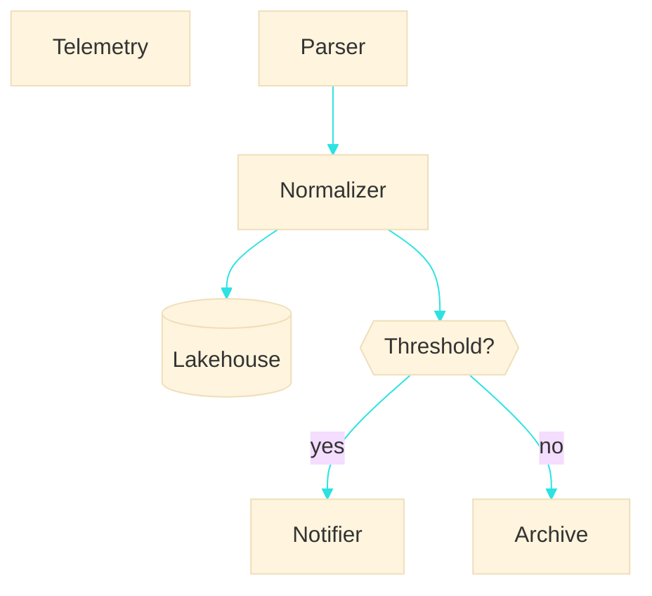
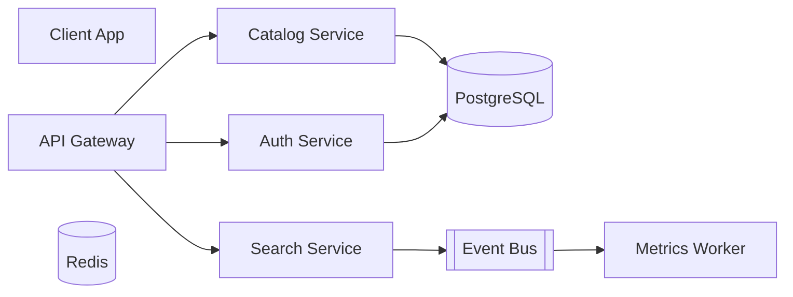

# Graph Alias Samples

## Graph TD Alias

## Graph LR With Branching And Cross Links

```mermaid
flowchart TD
%%{init: {'theme': 'base', 'themeVariables': {'background': '#d31d1d'}}}%%
    accTitle: ey
    Input[Telemetry]
    Parse[Parser]
    Normalize[Normalizer]
    Store[(Lakehouse)]
    Alert{{Threshold?}}
    Notify[Notifier]
    Archive[Archive]
    Parse --> Normalize
    Normalize --> Store
    Normalize --> Alert
    Alert -->|yes| Notify
    Alert -->|no| Archive
```

```mermaid
flowchart LR
    accTitle: hola
    Client[Client App]
    Gateway[API Gateway]
    Auth[Auth Service]
    Catalog[Catalog Service]
    Search[Search Service]
    Redis[(Redis)]
    Db[(PostgreSQL)]
    Events[[Event Bus]]
    Metrics[Metrics Worker]
    Gateway --> Auth
    Gateway --> Catalog
    Gateway --> Search
    Catalog --> Db
    Auth --> Db
    Search --> Events
    Events --> Metrics
```