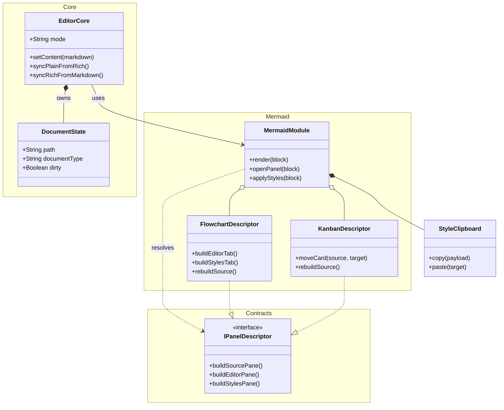

# Class Diagram Sample

## Namespaces, Interfaces, Inheritance And Relationships

```mermaid
classDiagram
    namespace Core {
      class EditorCore {
        +String mode
        +setContent(markdown)
        +syncPlainFromRich()
        +syncRichFromMarkdown()
      }
      class DocumentState {
        +String path
        +String documentType
        +Boolean dirty
      }
    }

    namespace Mermaid {
      class MermaidModule {
        +render(block)
        +openPanel(block)
        +applyStyles(block)
      }
      class FlowchartDescriptor {
        +buildEditorTab()
        +buildStylesTab()
        +rebuildSource()
      }
      class KanbanDescriptor {
        +moveCard(source, target)
        +rebuildSource()
      }
    }

    namespace Contracts {
      class IPanelDescriptor {
        <<interface>>
        +buildSourcePane()
        +buildEditorPane()
        +buildStylesPane()
      }
    }

    class StyleClipboard {
        +copy(payload)
        +paste(target)
    }

    EditorCore --> MermaidModule : uses
    EditorCore *-- DocumentState : owns
    MermaidModule ..> IPanelDescriptor : resolves
    FlowchartDescriptor ..|> IPanelDescriptor
    KanbanDescriptor ..|> IPanelDescriptor
    MermaidModule *-- StyleClipboard
    MermaidModule o-- FlowchartDescriptor
    MermaidModule o-- KanbanDescriptor
```
