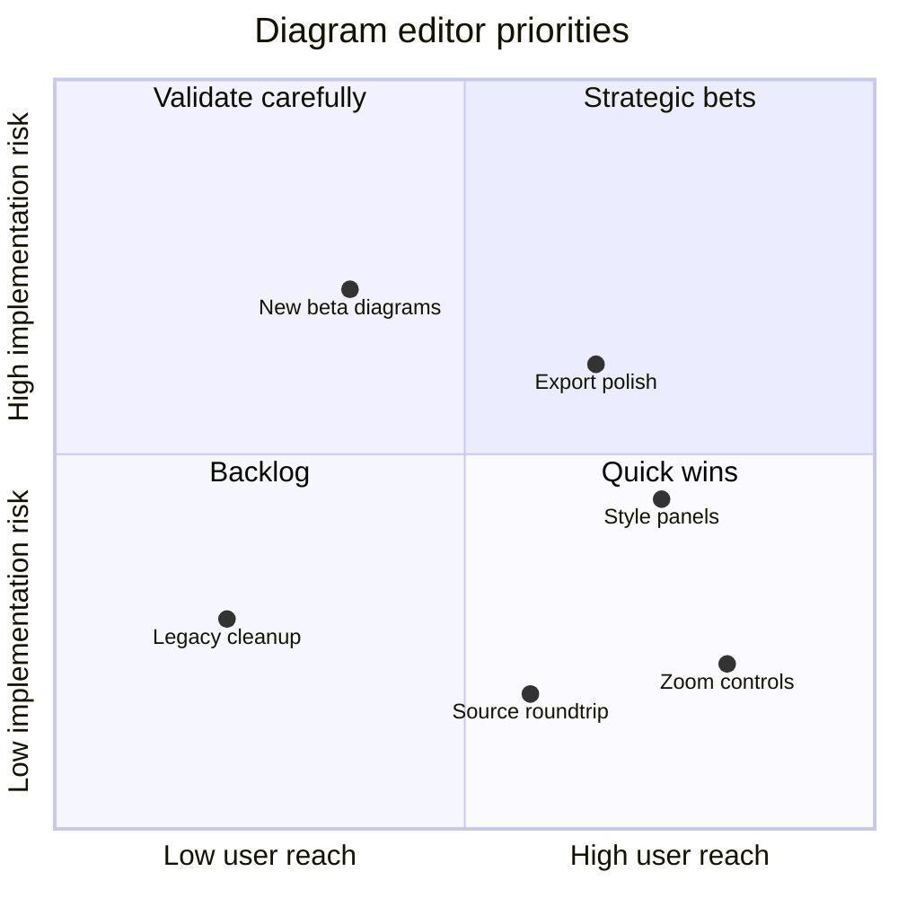

# Quadrant Chart Sample

```mermaid
quadrantChart
    title Diagram editor priorities
    x-axis Low user reach --> High user reach
    y-axis Low implementation risk --> High implementation risk
    quadrant-1 Strategic bets
    quadrant-2 Validate carefully
    quadrant-3 Backlog
    quadrant-4 Quick wins
    "Zoom controls": [0.82, 0.22]
    "Style panels": [0.74, 0.44]
    "Source roundtrip": [0.58, 0.18]
    "New beta diagrams": [0.36, 0.72]
    "Export polish": [0.66, 0.62]
    "Legacy cleanup": [0.21, 0.28]
```

