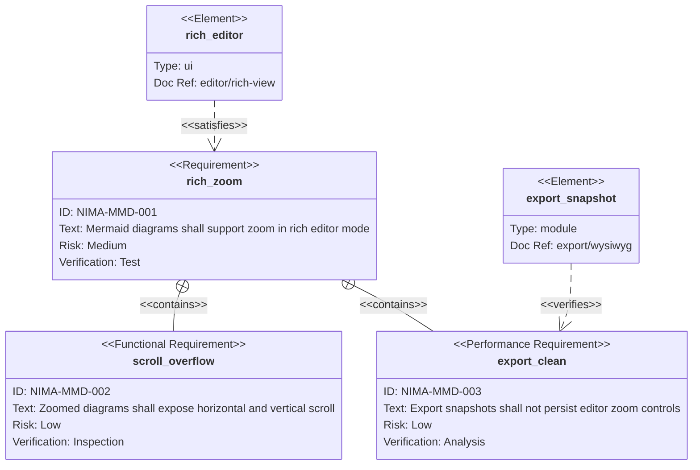

# Requirement Diagram Sample

```mermaid
requirementDiagram
    requirement rich_zoom {
        id: "NIMA-MMD-001"
        text: Mermaid diagrams shall support zoom in rich editor mode
        risk: medium
        verifymethod: test
    }

    functionalRequirement scroll_overflow {
        id: "NIMA-MMD-002"
        text: Zoomed diagrams shall expose horizontal and vertical scroll
        risk: low
        verifymethod: inspection
    }

    performanceRequirement export_clean {
        id: "NIMA-MMD-003"
        text: Export snapshots shall not persist editor zoom controls
        risk: low
        verifymethod: analysis
    }

    element rich_editor {
        type: ui
        docRef: "editor/rich-view"
    }

    element export_snapshot {
        type: module
        docRef: "export/wysiwyg"
    }

    rich_zoom - contains -> scroll_overflow
    rich_zoom - contains -> export_clean
    rich_editor - satisfies -> rich_zoom
    export_snapshot - verifies -> export_clean
```
