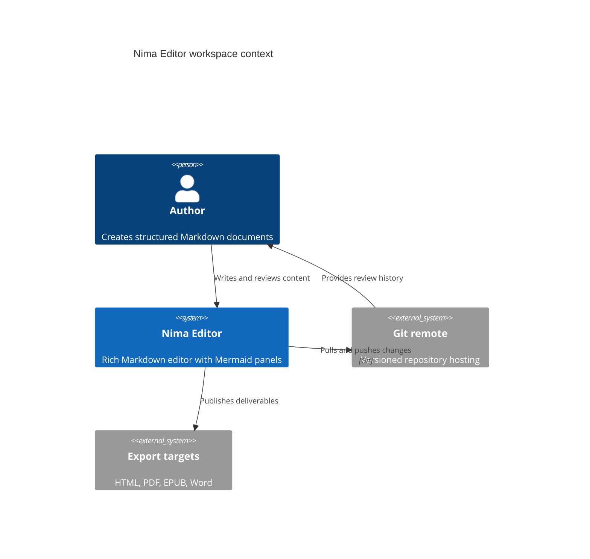

# C4 Diagram Sample

```mermaid
C4Context
    title Nima Editor workspace context
    Person(author, "Author", "Creates structured Markdown documents")
    System(editor, "Nima Editor", "Rich Markdown editor with Mermaid panels")
    System_Ext(remote, "Git remote", "Versioned repository hosting")
    System_Ext(exports, "Export targets", "HTML, PDF, EPUB, Word")

    Rel(author, editor, "Writes and reviews content")
    Rel(editor, remote, "Pulls and pushes changes", "Git")
    Rel(editor, exports, "Publishes deliverables")
    Rel(remote, author, "Provides review history")
```

