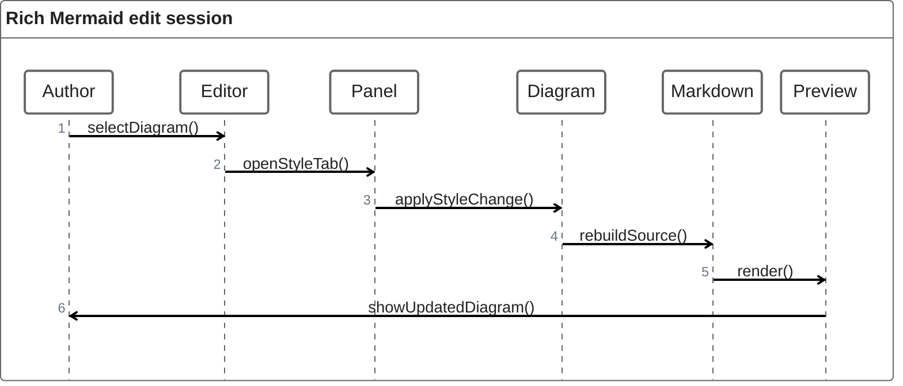

# ZenUML Sample

```mermaid
zenuml
    title Rich Mermaid edit session
    Author->Editor: selectDiagram()
    Editor->Panel: openStyleTab()
    Panel->Diagram: applyStyleChange()
    Diagram->Markdown: rebuildSource()
    Markdown->Preview: render()
    Preview->Author: showUpdatedDiagram()
```

