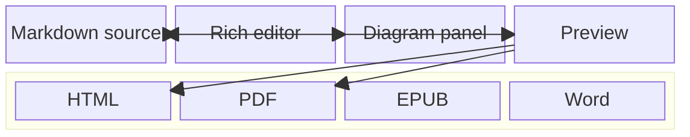

# Block Diagram Sample

```mermaid
block-beta
    columns 4
    source["Markdown source"] editor["Rich editor"] panel["Diagram panel"] preview["Preview"]
    source --> editor
    editor --> panel
    panel --> source
    editor --> preview
    block:exports:4
      html["HTML"]
      pdf["PDF"]
      epub["EPUB"]
      word["Word"]
    end
    preview --> html
    preview --> pdf
```

