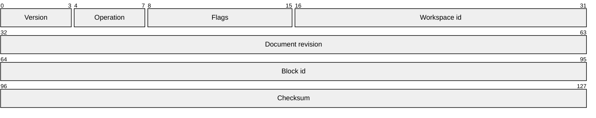

# Packet Diagram Sample

Packet diagrams describe bit-level structures. This sample models the metadata envelope that could be attached to a saved editor operation.

The ranges are bit positions. Larger fields make wide blocks, which is useful for testing zoom and horizontal scroll.

