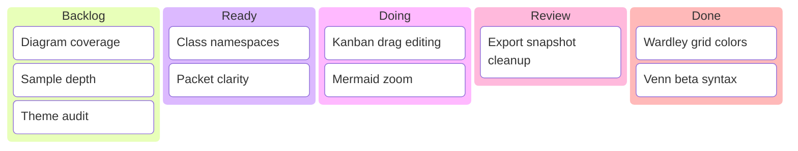

# Kanban Sample

```mermaid
kanban
    backlog[Backlog]
      diagramCoverage[Diagram coverage]
      sampleDepth[Sample depth]
      themeAudit[Theme audit]
    ready[Ready]
      classNamespaces[Class namespaces]
      packetExample[Packet clarity]
    doing[Doing]
      kanbanDrag[Kanban drag editing]
      zoomControls[Mermaid zoom]
    review[Review]
      exportSnapshot[Export snapshot cleanup]
    done[Done]
      wardleyGrid[Wardley grid colors]
      vennSyntax[Venn beta syntax]
```

