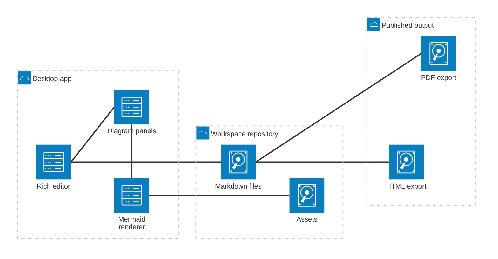

# Architecture Sample

```mermaid
architecture-beta
    group desktop(cloud)[Desktop app]
    group repo(cloud)[Workspace repository]
    group output(cloud)[Published output]

    service editor(server)[Rich editor] in desktop
    service panels(server)[Diagram panels] in desktop
    service renderer(server)[Mermaid renderer] in desktop
    service markdown(disk)[Markdown files] in repo
    service assets(disk)[Assets] in repo
    service pdf(disk)[PDF export] in output
    service html(disk)[HTML export] in output

    editor:R -- L:panels
    panels:B -- T:renderer
    editor:R -- L:markdown
    renderer:R -- L:assets
    markdown:R -- L:pdf
    markdown:R -- L:html
```

