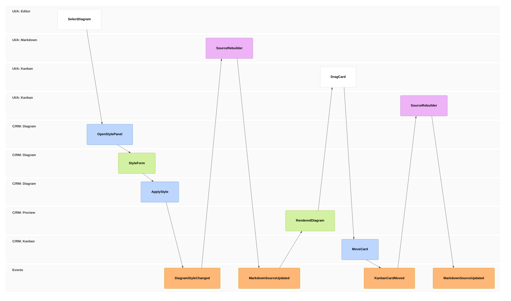

# Event Modeling Sample

```mermaid
eventmodeling
    tf 01 ui Editor.SelectDiagram
    tf 02 cmd Diagram.OpenStylePanel
    tf 03 rmo Diagram.StyleForm
    tf 04 cmd Diagram.ApplyStyle
    tf 05 evt DiagramStyleChanged
    tf 06 pcr Markdown.SourceRebuilder
    tf 07 evt MarkdownSourceUpdated
    tf 08 rmo Preview.RenderedDiagram
    tf 09 ui Kanban.DragCard
    tf 10 cmd Kanban.MoveCard
    tf 11 evt KanbanCardMoved
    tf 12 pcr Kanban.SourceRebuilder
    tf 13 evt MarkdownSourceUpdated
```
