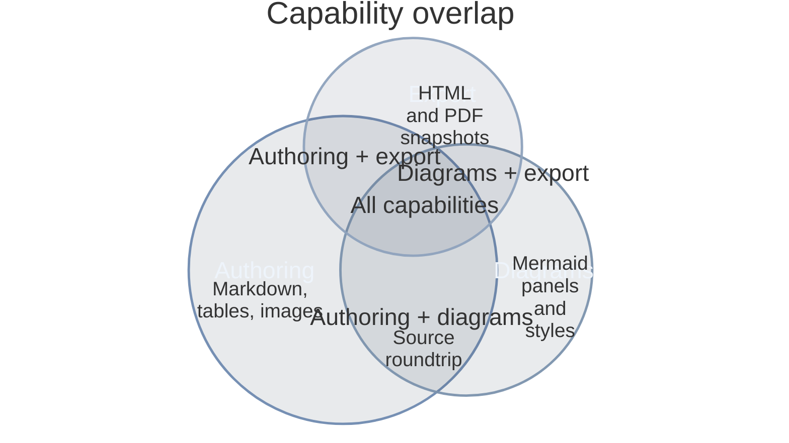

# Venn Sample

```mermaid
venn-beta
    title Capability overlap
    set Authoring["Authoring"]:48
      text AuthoringBlocks["Markdown, tables, images"]
    set Diagrams["Diagrams"]:32
      text DiagramBlocks["Mermaid panels and styles"]
    set Export["Export"]:24
      text ExportBlocks["HTML and PDF snapshots"]
    union Authoring,Diagrams["Authoring + diagrams"]:18
      text Roundtrip["Source roundtrip"]
    union Authoring,Export["Authoring + export"]:12
    union Diagrams,Export["Diagrams + export"]:9
    union Authoring,Diagrams,Export["All capabilities"]:6
    style Authoring fill:#243447,stroke:#6f8bb0,color:#eef4fb
    style Diagrams fill:#2d3b4d,stroke:#7c93ad,color:#eef4fb
    style Export fill:#334257,stroke:#8fa3bd,color:#eef4fb
```
