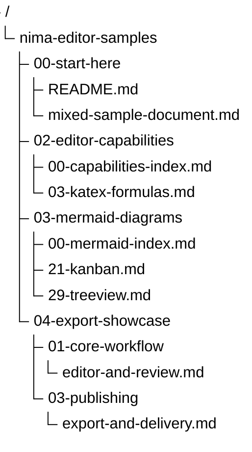

# TreeView Sample

```mermaid
treeView-beta
    "nima-editor-samples"
        "00-start-here"
            "README.md"
            "mixed-sample-document.md"
        "02-editor-capabilities"
            "00-capabilities-index.md"
            "03-katex-formulas.md"
        "03-mermaid-diagrams"
            "00-mermaid-index.md"
            "21-kanban.md"
            "29-treeview.md"
        "04-export-showcase"
            "01-core-workflow"
                "editor-and-review.md"
            "03-publishing"
                "export-and-delivery.md"
```

