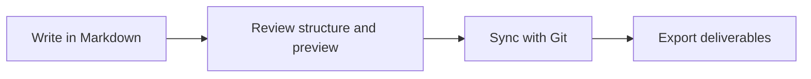

# Nima Editor Capabilities Showcase

Este directorio traduce la matriz de features de Nima Editor a archivos que se pueden abrir, editar y exportar dentro del repo de samples.

> [!TIP]
> Abre estos archivos primero en modo enriquecido y luego en modo texto plano para validar que el contenido sigue siendo Markdown portable.

## Mapa de muestras

Menuda locurota

| Archivo | Enfasis principal |
| --- | --- |
| [01-portable-markdown.md](./01-portable-markdown.md) | edicion base, callouts, listas, enlaces |
| [02-technical-blocks.md](./02-technical-blocks.md) | tablas, codigo, bloques tecnicos, Mermaid |
| [03-katex-formulas.md](./03-katex-formulas.md) | formulas inline y en bloque |
| [04-columns-and-images.md](./04-columns-and-images.md) | layouts en columnas, imagenes del proyecto |
| [05-product-workflow.md](./05-product-workflow.md) | flujo `write -> review -> sync -> export` |
| [../mermaid/flowchart.md](../mermaid/flowchart.md) | muestras dedicadas por familia de diagrama |
| [../export-showcase/summary.md](../export-showcase/summary.md) | proyecto jerarquico para exportacion por carpeta |

## Categorias cubiertas desde la matriz

- Core editing
- Technical content blocks
- Navigation and organization
- Review and history
- Export
- Git and docs-as-code
- Pro accelerators representados como zonas de prueba dentro de tablas, Mermaid, KaTeX, imagenes y layouts

## Flujo principal del producto

## Checklist rapido

- Editar texto, titulos y listas
- Cambiar tablas y comprobar roundtrip
- Modificar un bloque Mermaid
- Tocar una formula KaTeX
- Probar una imagen con toolbar visual
- Exportar `export-showcase/` a PDF o HTML

> [!IMPORTANT]
> Estas muestras no intentan cubrir colaboracion Team. Estan centradas en las capacidades visibles hoy para Free y Pro.