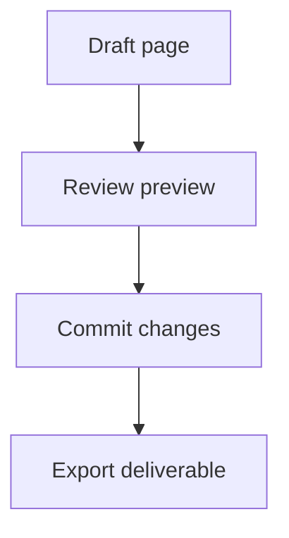

# Technical Blocks

Esta pagina reune bloques tecnicos que suelen activarse con tooling especifico dentro de Nima Editor.

> [!TIP]
> Usa esta muestra para probar resaltado de codigo, acciones rapidas inline y edicion de tablas.

## Tabla editable

| Bloque | Rol en documentacion tecnica | Zona de prueba |
| --- | --- | --- |
| Mermaid | diagramas y flujos | editar nodos y flechas |
| KaTeX | formulas y expresiones | cambiar simbolos |
| Codigo | ejemplos reproducibles | probar syntax highlight |
| Tabla | especificaciones y matrices | insertar filas y columnas |

## Codigo TypeScript

```ts
type ExportFormat = 'pdf' | 'html' | 'docx' | 'epub';

interface PublishJob {
  target: ExportFormat;
  includeDiagrams: boolean;
  includeImages: boolean;
}

const job: PublishJob = {
  target: 'pdf',
  includeDiagrams: true,
  includeImages: true,
};

console.log(job);
```

## Codigo JSON

```json
{
  "editorMode": "rich",
  "syncStrategy": "current-branch",
  "exportPreset": "manual-pdf"
}
```

## Mermaid embebido



Mas variaciones estan en [../mermaid/flowchart.md](../mermaid/flowchart.md).

## Bloque de shell

```bash
git status
git add docs/
git commit -m "docs: update operator guide"
git push
```

> [!NOTE]
> Aunque Git es una capacidad de flujo y no de sintaxis, este tipo de bloque ayuda a comprobar documentacion tecnica realista.
