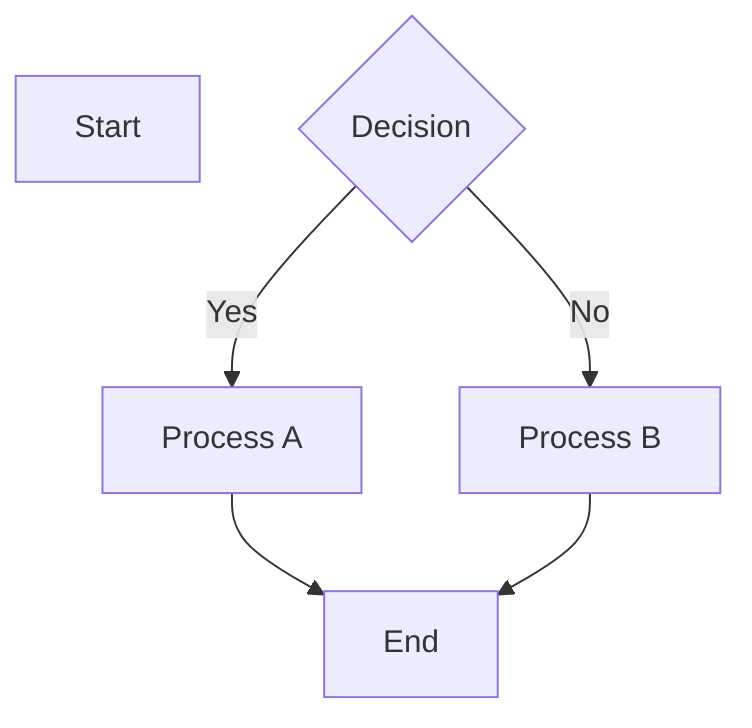

# Table of Contents - mermaid

Path: `mermaid`

Folders: 0 | Files: 13

## Contents

- [flowchart](mermaid/flowchart.md)
- [graph](mermaid/graph.md)
- [03-sequence-diagram](mermaid/03-sequence-diagram.md)
- [04-class-diagram](mermaid/04-class-diagram.md)
- [05-state-diagram-v2](mermaid/05-state-diagram-v2.md)
- [06-er-diagram](mermaid/06-er-diagram.md)
- [07-pie](mermaid/07-pie.md)
- [08-gantt](mermaid/08-gantt.md)
- [09-journey](mermaid/09-journey.md)
- [10-mindmap](mermaid/10-mindmap.md)
- [11-timeline](mermaid/11-timeline.md)
- [12-gitgraph](mermaid/12-gitgraph.md)
- [13-xychart-beta](mermaid/13-xychart-beta.md)

