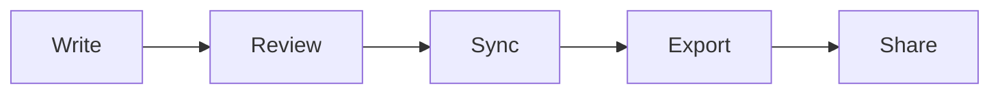

# Product Workflow Showcase

Esta pagina resume el flujo comercial y funcional que la matriz deja como posicion principal del producto:

`write -> review -> sync -> export`

## Diagrama del flujo

## Lo que este repo ya permite mostrar

| Area | Muestra en el repo | Capacidad asociada |
| --- | --- | --- |
| Core editing | archivos en `blocks/` | editor Markdown, rich mode, preview |
| Technical docs | `blocks/02` + `mermaid/` + `blocks/03` | Mermaid, KaTeX, tablas, codigo |
| Layout and media | `blocks/04` + `images/` | columnas, imagenes del proyecto |
| Export by folder | `../export-showcase/summary.md` | exportacion jerarquica |
| Git narrative | esta misma pagina | status, history, diff, commit, sync |

## Baseline vs acceleration

| Nivel | Que representa en estas muestras |
| --- | --- |
| Free baseline | escribir, revisar, navegar, sincronizar rama actual, export basico |
| Pro acceleration | helpers de Mermaid, tablas, KaTeX, imagenes, layouts, export avanzado |

## Manual QA sugerido

1. Abre `blocks/01-portable-markdown.md` y edita formato inline.
2. Cambia una tabla o un bloque de codigo en `blocks/02-technical-blocks.md`.
3. Modifica una formula en `blocks/03-katex-formulas.md`.
4. Redimensiona la imagen en `blocks/04-columns-and-images.md`.
5. Exporta `export-showcase/` como documento final.

> [!TIP]
> Si quieres probar la tesis `docs-as-code`, usa cualquier archivo de este repo para revisar diff, historial y commit sobre la rama actual.
