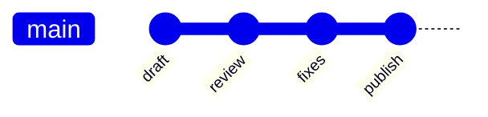

# Git And History

La matriz deja claro que el flujo Git minimo debe existir incluso en la experiencia base.

## Flujo minimo esperado

- abrir repositorio local
- ver estado de cambios
- revisar diff
- hacer commit
- push y pull en la rama actual

## Nota de producto

Las ramas avanzadas, comparacion entre ramas, merge, rebase y resolucion guiada de conflictos pertenecen a la zona `Pro`.
