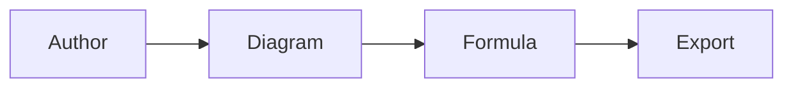
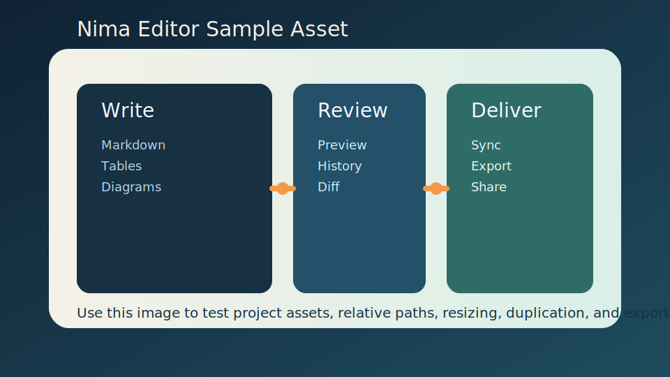

# Diagrams, Formulas And Layout

Esta pagina mezcla varios bloques tecnicos en una sola unidad exportable.

## Mermaid



## KaTeX

$$
quality\ score = \frac{approved\ sections}{total\ sections}
$$

## Imagen del proyecto



## Columnas

:::columns 2

### Bloque izquierdo

- Mermaid
- KaTeX
- tablas

:::column

### Bloque derecho

- imagenes con rutas relativas
- layouts portables
- exportacion final

:::endcolumns

## Codigo

```yaml
document:
  title: Export Showcase
  include_mermaid: true
  include_katex: true
  include_images: true
```
