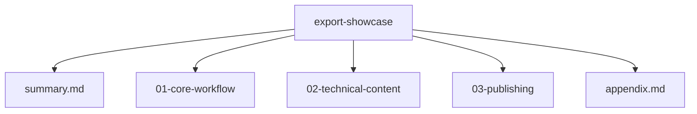

# Export Showcase

Este arbol esta construido especificamente para demostrar la exportacion jerarquica por carpeta o proyecto.

> [!TIP]
> Exporta la carpeta `export-showcase/` completa para comprobar portada, secciones, subpaginas y apendice en un solo documento.

## Estructura

| Ruta | Rol |
| --- | --- |
| `summary.md` | portada / introduccion |
| `01-core-workflow/` | primera seccion del documento |
| `02-technical-content/` | segunda seccion con bloques tecnicos |
| `03-publishing/` | seccion final de entrega |
| `appendix.md` | apendice al final |

## Objetivo

Este proyecto resume las capacidades visibles de Nima Editor dentro de una estructura apta para:

- navegacion jerarquica
- lectura continua
- exportacion a PDF, HTML, DOCX y EPUB
- validacion de headings y orden de secciones

