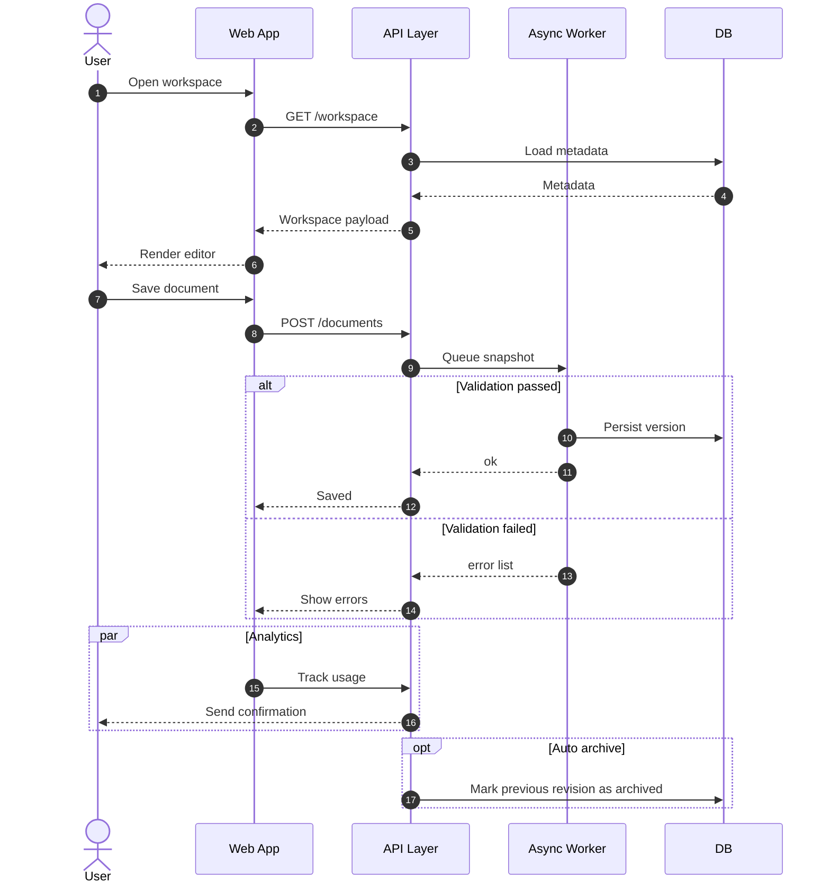

# Sequence Diagram Samples

## Notes, Activation And Control Blocks

```mermaid
sequenceDiagram
    actor User
    participant Web as Web App
    participant API as API Layer
    participant Worker as Async Worker
    autonumber
    User->>Web: Open workspace
    Web->>API: GET /workspace
    API->>DB: Load metadata
    DB-->>API: Metadata
    API-->>Web: Workspace payload
    Web-->>User: Render editor
    User->>Web: Save document
    Web->>API: POST /documents
    API->>Worker: Queue snapshot
    alt Validation passed
    Worker->>DB: Persist version
    Worker-->>API: ok
    API-->>Web: Saved
    else Validation failed
    Worker-->>API: error list
    API-->>Web: Show errors
    end
    par Analytics
    Web->>API: Track usage
    API-->>User: Send confirmation
    end
    opt Auto archive
    API->>DB: Mark previous revision as archived
    end
```