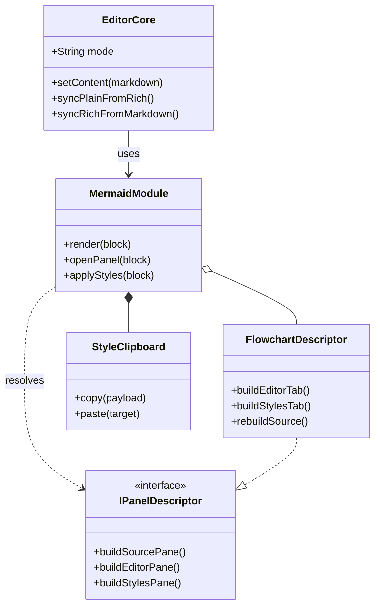

# Class Diagram Samples

## Inheritance, Interfaces And Relationships

```mermaid
classDiagram
    class EditorCore {
        +String mode
        +setContent(markdown)
        +syncPlainFromRich()
        +syncRichFromMarkdown()
    }

    class MermaidModule {
        +render(block)
        +openPanel(block)
        +applyStyles(block)
    }

    class FlowchartDescriptor {
        +buildEditorTab()
        +buildStylesTab()
        +rebuildSource()
    }

    class IPanelDescriptor {
        <<interface>>
        +buildSourcePane()
        +buildEditorPane()
        +buildStylesPane()
    }

    class StyleClipboard {
        +copy(payload)
        +paste(target)
    }

    EditorCore --> MermaidModule : uses
    MermaidModule ..> IPanelDescriptor : resolves
    FlowchartDescriptor ..|> IPanelDescriptor
    MermaidModule *-- StyleClipboard
    MermaidModule o-- FlowchartDescriptor
```
