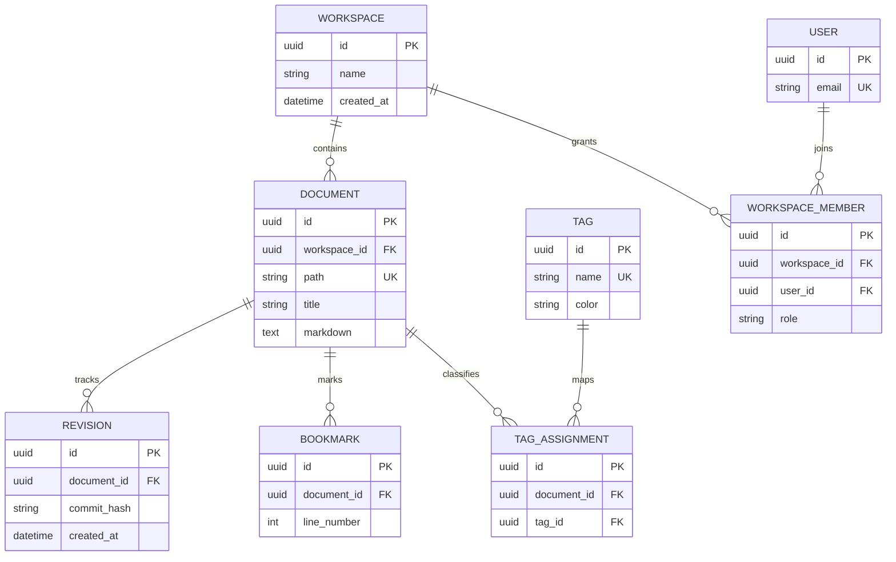

# ER Diagram Samples

## Keys, Types And Cardinalities

```mermaid
erDiagram
    WORKSPACE ||--o{ DOCUMENT : contains
    DOCUMENT ||--o{ REVISION : tracks
    DOCUMENT ||--o{ BOOKMARK : marks
    DOCUMENT ||--o{ TAG_ASSIGNMENT : classifies
    TAG ||--o{ TAG_ASSIGNMENT : maps
    USER ||--o{ WORKSPACE_MEMBER : joins
    WORKSPACE ||--o{ WORKSPACE_MEMBER : grants

    WORKSPACE {
        uuid id PK
        string name
        datetime created_at
    }

    DOCUMENT {
        uuid id PK
        uuid workspace_id FK
        string path UK
        string title
        text markdown
    }

    REVISION {
        uuid id PK
        uuid document_id FK
        string commit_hash
        datetime created_at
    }

    TAG {
        uuid id PK
        string name UK
        string color
    }

    BOOKMARK {
        uuid id PK
        uuid document_id FK
        int line_number
    }

    TAG_ASSIGNMENT {
        uuid id PK
        uuid document_id FK
        uuid tag_id FK
    }

    USER {
        uuid id PK
        string email UK
    }

    WORKSPACE_MEMBER {
        uuid id PK
        uuid workspace_id FK
        uuid user_id FK
        string role
    }
```
