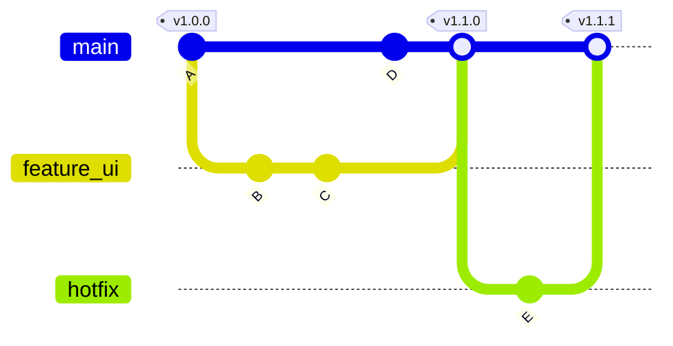

# GitGraph Samples

## Branches, Merge And Hotfix

```mermaid
gitGraph
    commit id: "A" tag: "v1.0.0"
    branch feature_ui
    checkout feature_ui
    commit id: "B"
    commit id: "C"
    checkout main
    commit id: "D"
    merge feature_ui tag: "v1.1.0"
    branch hotfix
    checkout hotfix
    commit id: "E"
    checkout main
    merge hotfix tag: "v1.1.1"
```
