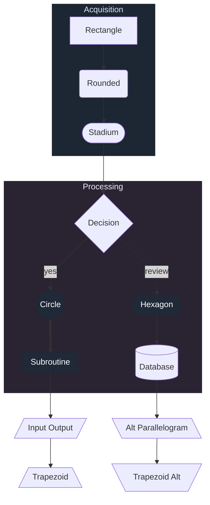
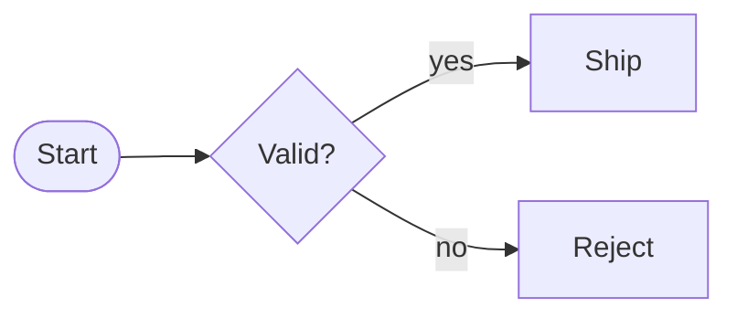
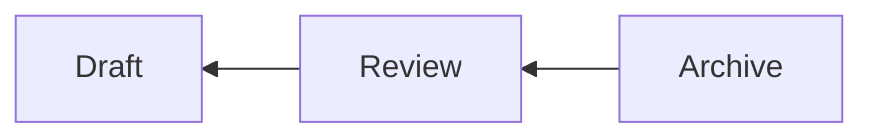
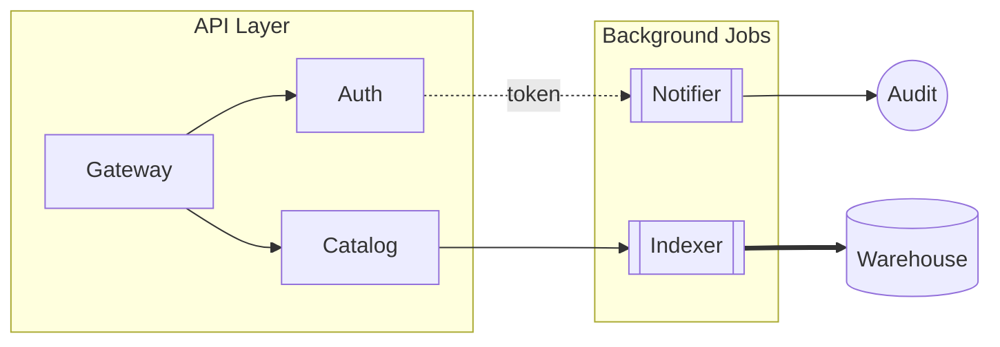

# Flowchart Samples

## TD With Shapes, Labels, Styles And Subgraphs

```mermaid
flowchart TD
    A[Rectangle] --> B(Rounded)
    B --> C([Stadium])
    C --> D{Decision}
    D -->|yes| E((Circle))
    D -.->|review| F{{Hexagon}}
    E ==> G[[Subroutine]]
    F --> H[(Database)]
    G --> I[/Input Output/]
    H --> J[\Alt Parallelogram\]
    I --> K[/Trapezoid\]
    J --> L[\Trapezoid Alt/]

    subgraph SG1 [Acquisition]
        A
        B
        C
    end

    subgraph SG2 [Processing]
        D
        E
        F
        G
        H
    end

    classDef highlight fill:#1f2937,stroke:#1f2937,color:#ffffff
    class E,F,G highlight
    style SG1 fill:#1d2633,stroke:#1d2633,color:#dce7f7
    style SG2 fill:#2a2432,stroke:#2a2432,color:#f2e9ff
```

## Direction Variants

### LR

```mermaid
flowchart LR
    Start([Start]) --> Validate{Valid?}
    Validate -->|yes| Ship[Ship]
    Validate -->|no| Reject[Reject]
```

### RL

```mermaid
flowchart RL
    Archive[Archive] --> Review[Review] --> Draft[Draft]
```

### BT

```mermaid
flowchart BT
    End([End]) --> Verify --> Build --> Plan
```

## Styling Copy/Paste Stress Sample

```mermaid
flowchart LR
    subgraph API [API Layer]
        A[Gateway]
        B[Auth]
        C[Catalog]
    end

    subgraph JOBS [Background Jobs]
        D[[Indexer]]
        E[[Notifier]]
    end

    A --> B
    A --> C
    C --> D
    B -. token .-> E
    D ==> F[(Warehouse)]
    E --> G((Audit))
```