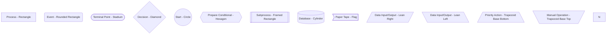
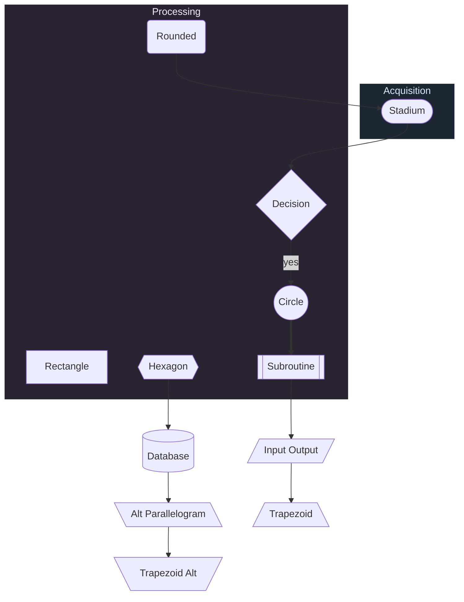
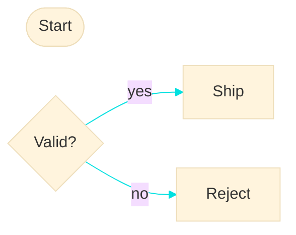
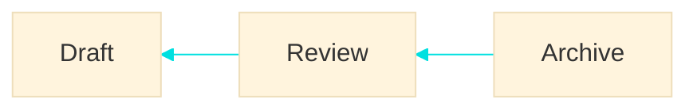
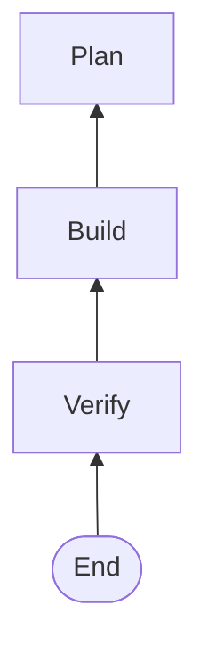
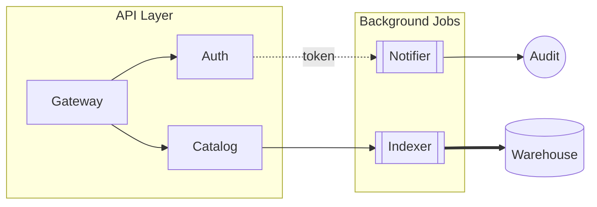

# Flowchart Samples

## Node Type Naming Proposal

```mermaid
flowchart BT
    A[Process - Rectangle]
    B(Event - Rounded Rectangle)
    C([Terminal Point - Stadium])
    D{Decision - Diamond}
    E((Start - Circle))
    F{{Prepare Conditional - Hexagon}}
    G[[Subprocess - Framed Rectangle]]
    H[(Database - Cylinder)]
    I>Paper Tape - Flag]
    J[/Data Input/Output - Lean Right/]
    K[\Data Input/Output - Lean Left\]
    L[/Priority Action - Trapezoid Base Bottom\]
    M[\Manual Operation - Trapezoid Base Top/]
    N[N]
```

## TD With Shapes, Labels, Styles And Subgraphs

```mermaid
flowchart TD
    H[(Database)]
    I[/Input Output/]
    J[\Alt Parallelogram\]
    K[/Trapezoid\]
    L[\Trapezoid Alt/]
    SG1[Acquisition]
    SG2[Processing]
    subgraph SG1 [Acquisition]
        C([Stadium])
    end
    subgraph SG2 [Processing]
        B(Rounded)
        A[Rectangle]
        D{Decision}
        E((Circle))
        F{{Hexagon}}
        G[[Subroutine]]
    end
    B --> C
    C --> D
    D -->|yes| E
    E ==> G
    F --> H
    G --> I
    H --> J
    I --> K
    J --> L
    style SG1 fill:#1d2633,stroke:#1d2633,color:#dce7f7
    style SG2 fill:#2a2432,stroke:#2a2432,color:#f2e9ff
```

## Direction Variants

### LR

```mermaid
flowchart LR
%%{init: {'theme': 'base', 'themeVariables': {'background': '#ff1f1f'}}}%%
Start([Start])
    Validate{Valid?}
    Ship[Ship]
    Reject[Reject]
    Validate -->|yes| Ship
    Validate -->|no| Reject
```

### RL

```mermaid
flowchart RL
%%{init: {'theme': 'base', 'themeVariables': {'background': '#ff1f1f'}}}%%
    Archive[Archive] --> Review[Review] --> Draft[Draft]
```

### BT

```mermaid
flowchart BT
    End([End]) --> Verify --> Build --> Plan
```

## Styling Copy/Paste Stress Sample

```mermaid
flowchart LR
    subgraph API [API Layer]
        A[Gateway]
        B[Auth]
        C[Catalog]
    end

    subgraph JOBS [Background Jobs]
        D[[Indexer]]
        E[[Notifier]]
    end

    A --> B
    A --> C
    C --> D
    B -. token .-> E
    D ==> F[(Warehouse)]
    E --> G((Audit))
```