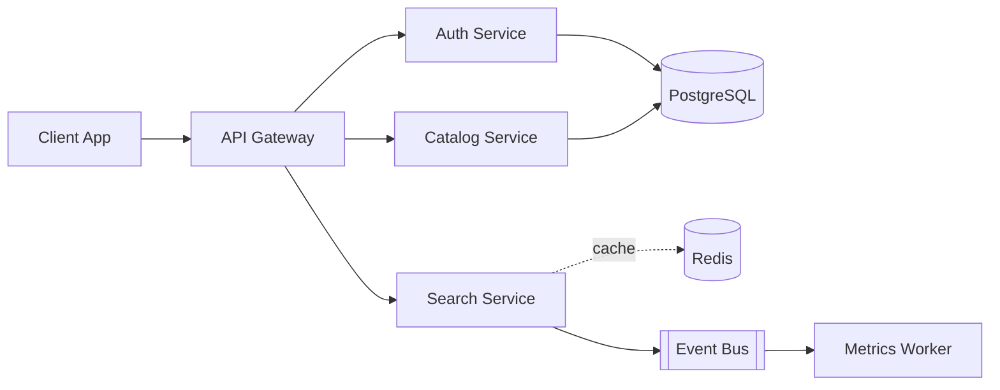
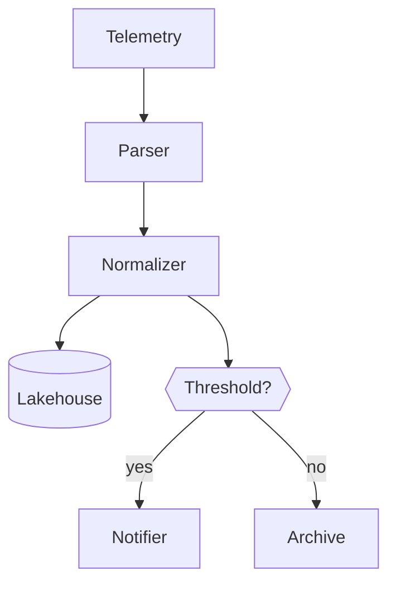

# Graph Alias Samples

## Graph LR With Branching And Cross Links

```mermaid
graph LR
    Client[Client App] --> Gateway[API Gateway]
    Gateway --> Auth[Auth Service]
    Gateway --> Catalog[Catalog Service]
    Gateway --> Search[Search Service]
    Search -. cache .-> Redis[(Redis)]
    Catalog --> Db[(PostgreSQL)]
    Auth --> Db
    Search --> Events[[Event Bus]]
    Events --> Metrics[Metrics Worker]
```

## Graph TD Alias

```mermaid
graph TD
    Input[Telemetry] --> Parse[Parser]
    Parse --> Normalize[Normalizer]
    Normalize --> Store[(Lakehouse)]
    Normalize --> Alert{{Threshold?}}
    Alert -->|yes| Notify[Notifier]
    Alert -->|no| Archive[Archive]
```
